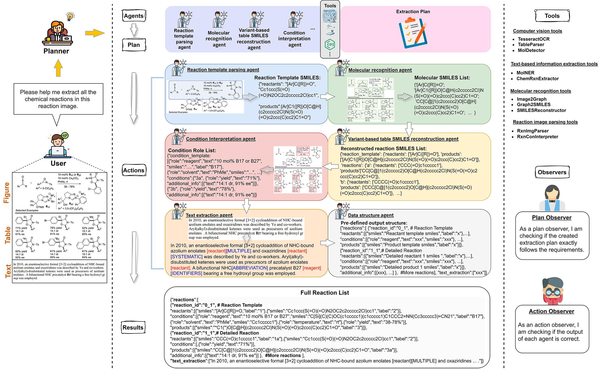
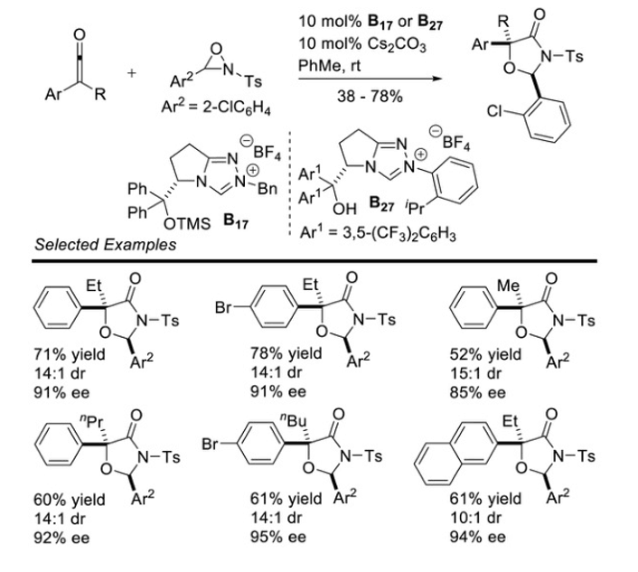

# ChemEagle


## :sparkles: Highlights
<p align="justify">
In this work, we present ChemEagle, a multimodal large language model (MLLM)-based multi-agent system that integrates diverse chemical information extraction tools to extract multimodal chemical reactions. By integrating 7 expert-designed tools and 6 chemical information extraction agents, ChemEagle not only processes individual modalities but also utilizes MLLMs' reasoning capabilities to unify extracted data, ensuring more accurate and comprehensive reaction representations. By bridging multimodal gaps, our approach significantly improves automated chemical knowledge extraction, facilitating more robust AI-driven chemical research.

[comment]: <> ()

<div align="center">
An example workflow of our ChemEagle. It illustrates how ChemEagle extracts and structures multimodal chemical reaction data. Each agent handles specific tasks, from reaction image parsing and molecular recognition to SMILES reconstruction and condition role interpretation, ensuring accurate and structured data integration.
</div> 

## :rocket: Using the code and the model
### Using the code
Clone the following repositories:
```
git clone https://github.com/CYF2000127/ChemEagle
```
### Example usage of the model
1. First create and activate a [conda](https://numdifftools.readthedocs.io/en/stable/how-to/create_virtual_env_with_conda.html) environment with the following command in a Linux, Windows, or MacOS environment (Linux is the most recommended):
```
conda create -n chemeagle python=3.10
conda activate chemeagle
```

2. Then install requirements:
```
pip install -r requirements.txt
```

3. Set up your API keys in your environment.
```
export API_KEY=your-openai-api-key
```
Alternatively, add your API keys in the [api_key.txt](./api_key.txt)

4. Run the following code to extract multimodal chemical reactions from a multimodal reaction image:
```python
from main import ChemEagle
image_path = './examples/1.png'
results = ChemEagle(image_path)
print(results)

The input is a multimodal chemical reaction image:

<div align="center",width="50">
Example input molecular image.
</div> 
The output dictionary is a full reaction list with reactant SMILES, product SMILES, and detailed conditions for every reaction in the image:

``` 
{"reactions":[
{"reaction_id":"0_1",
"reactants":[{"smiles":"*C(*)=O","label":"1"},{"smiles":"Cc1ccc(S(=O)(=O)N2OC2c2ccccc2Cl)cc1","label":"2"}],
"conditions":[{"role":"reagent","text":"10 mol% B17 orB27","smiles":"C(C=CC=C1)=C1C[N+]2=CN3[C@H](C(C4=CC=CC=C4)(C5=CC=CC=C5)O[Si](C)(C)C(C)(C)C)CCC3=N2.F[B-](F)(F)F","label":"B17"},{"role":"reagent","text":"10 mol% B17 or B27","smiles":"CCCC(C=CC=C1)=C1[N+]2=CN3[C@H](C(C1=CC(=CC(=C1C(F)(F)F)C(F)(F)F))(C1=CC(=CC(=C1C(F)(F)F)C(F)(F)F))O)CCC3=N2.F[B-](F)(F)F","label":"B27"},{"role":"reagent","text":"10 mol% Cs2CO3","smiles":"[Cs+].[Cs+].[O-]C(=O)[O-]"},{"role":"solvent","text":"PhMe","smiles":"Cc1ccccc1"},{"role":"temperature","text":"rt"},{"role":"yield","text":"3878%"}],
"products":[{"smiles":"*C1*O[C@H](c2ccccc2Cl)N(S(=O)(=O)c2ccc(C)cc2)C1=O","label":"3"}]},

{"reaction_id":"1_1",
"reactants":[{"smiles":"CCC(=O)c1ccccc1","label":"1a"},{"smiles":"Cc1ccc(S(=O)(=O)N2OC2c2ccccc2Cl)cc1","label":"2a"}],
"conditions":[{"role":"reagent","text":"10 mol% B17 or B27","smiles":"C(C=CC=C1)=C1C[N+]2=CN3[C@H](C(C4=CC=CC=C4)(C5=CC=CC=C5)O[Si](C)(C)C(C)(C)C)CCC3=N2.F[B-](F)(F)F","label":"B17"},{"role":"reagent","text":"10 mol% B17 or B27","smiles":"CCCC(C=CC=C1)=C1[N+]2=CN3[C@H](C(C1=CC(=CC(=C1C(F)(F)F)C(F)(F)F))(C1=CC(=CC(=C1C(F)(F)F)C(F)(F)F))O)CCC3=N2.F[B-](F)(F)F","label":"B27"},{"role":"reagent","text":"10 mol% Cs2CO3","smiles":"[Cs+].[Cs+].[O-]C(=O)[O-]"},{"role":"solvent","text":"PhMe","smiles":"Cc1ccccc1"},{"role":"temperature","text":"rt"},{"role":"yield","text":"71%"}],
"products":[{"smiles":"CC[C@]1(c2ccccc2)O[C@H](c2ccccc2Cl)N(S(=O)(=O)c2ccc(C)cc2)C1=O","label":"3a"}],
"additional_info":[{"text":"14:1 dr, 91% ee"}]}
]
}
``` 
